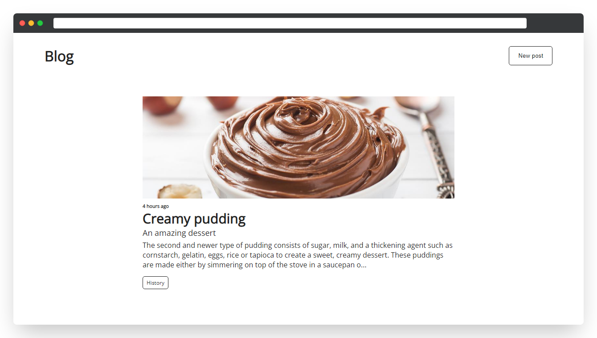

# Blog



## Built with

- [MongoDB](https://www.mongodb.com/)
- [Express](https://expressjs.com/)
- [React](https://reactjs.org/)
- [Node.js](https://nodejs.org/en/)
- [Redux](https://redux.js.org/)

## Installation

```sh
git clone https://github.com/atumv/blog.git && cd blog/server && npm i && cd ../client && npm i
```

## Running

in one terminal window:
```sh
cd blog/server && npm start
```
in another terminal window:
```sh
cd blog/client && npm start
```
